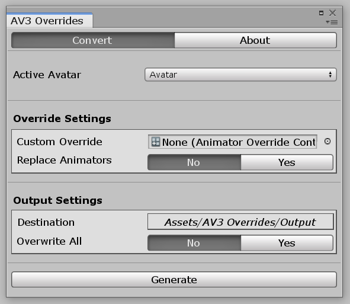
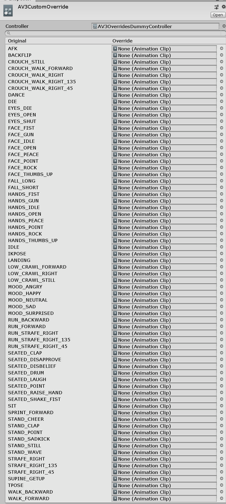

VRC AV3 Overrides
==============

Author: Joshuarox100

Usage: This package is meant for use with VRChat's Avatars 3.0 (VRCSDK3-AVATAR)

Description: Make upgrading to 3.0 a breeze with AV3 Overrides!

Dependencies: 
- [BMB Libraries](https://github.com/Joshuarox100/BMB-Libraries) (Included)
- VRCSDK3-AVATAR (Not Included)

Setting Up
--------------
**NOTE: This tool is really only meant to be used once per Avatar, as a way of setting up the basic stuff quickly so you can start working on the new things faster. Although you can, this tool won't help much with Avatars you already have set up since it doesn't modify existing Animators.**

1) Download and import the latest **Unity Package** from [**Releases**](https://github.com/Joshuarox100/VRC-AV3-Overrides/releases) on GitHub **(You will have issues if you don't)**.

2) Duplicate the AV3 Override Controller located in the AV3 Overrides folder.

  

3) Next, modify the duplicate as you wish with whatever Animations you want.
	>A list of what each Animation is for (and what types are compatible) can be found [here](#av3-override-controller).

  

4) Once you have it how you like, open the [Conversion Window](#conversion-window) found under Window -> AV3 Tools -> AV3 Overrides. 

  

5. Configure the provided settings as you'd like, drag in your duplicate Controller, and click Generate to convert it into Animators you can use in the Avatar Descriptor.
	>Upon a successful generation, the created Animators will automatically be slotted into the descriptor in their corresponding spots (unless if one is already present and you haven't turned on Replace Animators).

  

Everything should now be fully set up! If you have any issues or questions, look in the [troubleshooting](#troubleshooting) and [questions](#common-questions) section below before [contacting me](#contacting-me).

Conversion Window
--------------

  

| Setting | Function |
| --------- | ---------- |
| Active Avatar | The Avatar you want to convert an override for. |
| Custom Override | The AV3 Override Controller to be converted. |
| Replace Animators | Replace Animators already present in the Avatar Descriptor. |
| Destination | The folder where generated files will be saved to. |
| Overwrite All | Automatically overwrite existing files if needed. |

AV3 Override Controller
--------------

  

| Animation | Purpose |
| :-------: | ---------- |
| AFK | **(Transforms Only)** Plays whenever you press END, open the SteamVR Overlay, or take off your headset. |
| BACKFLIP | **(Transforms Only)** One of the 8 default standing Emotes. |
| CROUCH_STILL | **(Transforms Only)** Plays whenever you're crouched and not moving. |
| CROUCH_WALK_FORWARD | **(Transforms Only)** Plays whenever you're crouched and walking forward. |
| CROUCH_WALK_RIGHT | **(Transforms Only) \[Mirrored for Left]** Plays whenever you're crouched and walk directly right. |
| CROUCH_WALK_RIGHT_135 | **(Transforms Only) \[Mirrored for Left]** Plays whenever you're crouched and walk to the right slightly diagonally. |
| CROUCH_WALK_RIGHT_45 | **(Transforms Only) \[Mirrored for Left]** Plays whenever you're crouched and walk diagonally. |
| DANCE | **(Transforms Only)** One of the 8 default standing Emotes. |
| DIE | **(Transforms Only)** One of the 8 default standing Emotes. |
| EYES_DIE | **(Non-Transforms Only)** Plays to close your eyes when doing the DIE Emote. |
| EYES_OPEN | **(Non-Transforms Only)** Plays to open up your eyes when DIE has completed. |
| EYES_SHUT | **(Non-Transforms Only)** Plays to close your eyes when AFK. |
| FACE_FIST | **(Non-Transforms Only)** Plays when gesturing a fist. |
| FACE_GUN | **(Non-Transforms Only)** Plays when gesturing a hand gun. |
| FACE_OPEN | **(Non-Transforms Only)** Plays when gesturing an open hand. |
| FACE_PEACE | **(Non-Transforms Only)** Plays when gesturing a peace sign. |
| FACE_ROCK | **(Non-Transforms Only)** Plays when gesturing rock and roll. |
| FACE_THUMBS_UP | **(Non-Transforms Only)** Plays when gesturing a thumbs up. |
| FALL_LONG | **(Transforms Only)** Plays after falling for a long while. |
| FALL_SHORT | **(Transforms Only)** Plays when you start falling. |
| HANDS_FIST | **(Transforms Only)** Plays when gesturing a fist. |
| HANDS_GUN | **(Transforms Only)** Plays when gesturing a hand gun. |
| HANDS_IDLE | **(Transforms Only)** Plays when you're not gesturing anything. |
| HANDS_OPEN | **(Transforms Only)** Plays when gesturing an open hand. |
| HANDS_PEACE | **(Transforms Only)** Plays when gesturing a peace sign. |
| HANDS_ROCK | **(Transforms Only)** Plays when gesturing rock and roll. |
| HANDS_THUMBS_UP | **(Transforms Only)** Plays when gesturing a thumbs up. |
| IDLE | **(Transforms Only)** Additional movement added to your body while idling. |
| IKPOSE | **(Transforms Only)** Animation used for determining major joint bends. |
| LANDING | **(Transforms Only)** Plays when landing from a jump. |
| LOW_CRAWL_FORWARD | **(Transforms Only)** Plays when prone and moving forward. |
| LOW_CRAWL_RIGHT | **(Transforms Only) \[Mirrored for Left]** Plays when prone and moving right. |
| LOW_CRAWL_STILL | **(Transforms Only)** Plays when prone and not moving. |
| MOOD_ANGRY | **(Non-Transforms Only)** Plays depending on your Avatar's mood. |
| MOOD_HAPPY | **(Non-Transforms Only)** Plays depending on your Avatar's mood. |
| MOOD_NEUTRAL | **(Non-Transforms Only)** Plays depending on your Avatar's mood. |
| MOOD_SAD | **(Non-Transforms Only)** Plays depending on your Avatar's mood. |
| MOOD_SURPRISED | **(Non-Transforms Only)** Plays depending on your Avatar's mood. |
| RUN_BACKWARD | **(Transforms Only)** Plays when running backwards. |
| RUN_FORWARD | **(Transforms Only)** Plays when running forwards. |
| RUN_STRAFE_RIGHT | **(Transforms Only) \[Mirrored for Left]** Plays when running directly right. |
| RUN_STRAFE_RIGHT_135 | **(Transforms Only) \[Mirrored for Left]** Plays when running right slightly diagonally. |
| RUN_STRAFE_RIGHT_45 | **(Transforms Only) \[Mirrored for Left]** Plays when running diagonally. |
| SEATED_CLAP* | **(Transforms Only)** One of the 8 default seated Emotes. |
| SEATED_DISAPPROVE* | **(Transforms Only)** One of the 8 default seated Emotes. |
| SEATED_DISBELIEF* | **(Transforms Only)** One of the 8 default seated Emotes. |
| SEATED_DRUM* | **(Transforms Only)** One of the 8 default seated Emotes. |
| SEATED_LAUGH* | **(Transforms Only)** One of the 8 default seated Emotes. |
| SEATED_POINT* | **(Transforms Only)** One of the 8 default seated Emotes. |
| SEATED_RAISE_HAND* | **(Transforms Only)** One of the 8 default seated Emotes. |
| SEATED_SHAKE_FIST* | **(Transforms Only)** One of the 8 default seated Emotes. |
| SIT | **(Transforms Only)** Plays while sitting. |
| SPRINT_FORWARD | **(Transforms Only)** Plays while sprinting forward. |
| STAND_CHEER | **(Transforms Only)** One of the 8 default standing Emotes. |
| STAND_CLAP | **(Transforms Only)** One of the 8 default standing Emotes. |
| STAND_POINT | **(Transforms Only)** One of the 8 default standing Emotes. |
| STAND_SADKICK | **(Transforms Only)** One of the 8 default standing Emotes. |
| STAND_STILL | **(Transforms Only)** Played while standing still. |
| STAND_WAVE | **(Transforms Only)** One of the 8 default standing Emotes. |
| STRAFE_RIGHT | **(Transforms Only) \[Mirrored for Left]** Plays when walking directly right. |
| STRAFE_RIGHT_135 | **(Transforms Only) \[Mirrored for Left]** Plays when walking right slightly diagonally. |
| STRAFE_RIGHT_45 | **(Transforms Only) \[Mirrored for Left]** Plays when walking diagonally. |
| SUPINE_GETUP | **(Transforms Only)** Played when exiting the DIE Emote. |
| TPOSE | **(Transforms Only)** Used for determining various measurements of your avatar, most notably the position of the viewpoint. |
| WALK_BACKWARD | **(Transforms Only)** Played while walking backwards. |
| WALK_FORWARD | **(Transforms Only)** Played while walking forwards. |

>\* \- Seated Emotes will not activate without use of a custom Expressions Menu.

Common Questions
--------------
**Can I use this to replace Animations within my own Animators?**
>No, I may release another tool later on for that if the demand is present. This tool is meant for upgrading 2.0 Avatars in an easier fashion so you can get on to learning and trying new things that Avatars 3.0 allows for.

Troubleshooting
--------------
**I don't have a menu for my Emotes when I go ingame.**
>If you put in a custom Expressions Menu or Expression Parameters into your Avatar Descriptor, this is expected. You will need to create a custom menu that uses VRCEmote (1 - 8) to trigger your emotes. (This also means you need to use the default parameters within your Expression Parameters list!)

**The window refuses to open.**
>To fix this, reset your Editor layout by clicking Layout in the top right of the Editor and clicking Reset Factory Settings, then attempt to open the window again.

**"Your Animation cannot be used for this because it modifies properties unusable in its layer!"**
>This will occur if you're trying to use a Animation that modifies Non-Transforms for an Animation within a layer that doesn't allow it (or vice versa). You can find out which Animations are 'Transforms Only' [here](#av3-override-controller). If your Animation modifies both Transforms and Non-Transforms, you'll need to split the Animation in two.

**"An exception occured!"**
>If this happens, ensure you have a clean install of AV3 Overrides, and if the problem persists, [let me know](#contacting-me)!

Contacting Me
--------------
If you still have some questions or recommendations you'd like to throw my way, you can ask me on Discord (Joshuarox100#5024) or leave a suggestion or issue on the [GitHub](https://github.com/Joshuarox100/VRC-AV3-Overrides/issues) page.